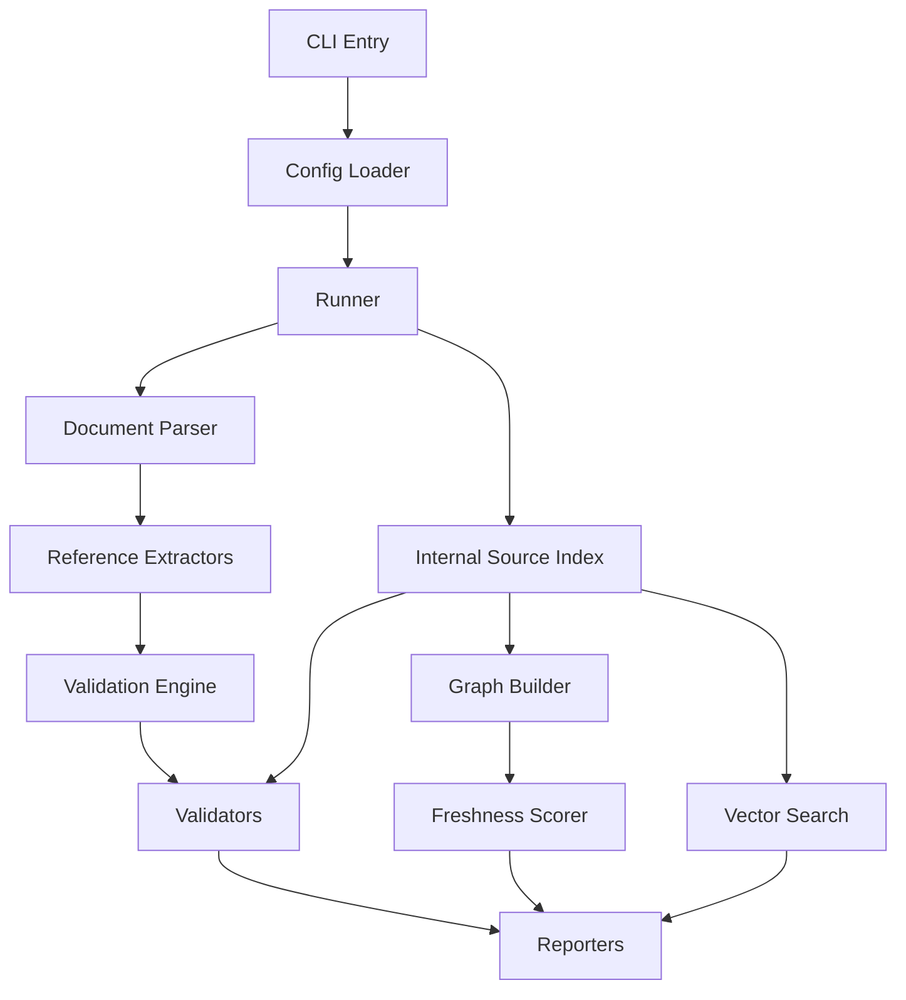

# Runtime Architecture

This document explains the execution pipeline for `doc-freshness-checker` and how each major module fits.

## End-to-End Flow

```mermaid
flowchart TD
    cli[CLI Entry]
    configLoader[Config Loader]
    runner[Runner]
    parser[Document Parser]
    extractors[Reference Extractors]
    engine[Validation Engine]
    validators[Validators]
    sourceIndex[Internal Source Index]
    graphBuild[Graph Builder]
    scoring[Freshness Scorer]
    vectorSearch[Vector Search]
    reporters[Reporters]

    cli --> configLoader
    configLoader --> runner
    runner --> parser
    parser --> extractors
    extractors --> engine
    engine --> validators
    runner --> sourceIndex
    sourceIndex --> validators
    sourceIndex --> graphBuild
    graphBuild --> scoring
    sourceIndex --> vectorSearch
    scoring --> reporters
    vectorSearch --> reporters
    validators --> reporters
```

## Main Modules

- `src/cli.ts`
  - Parses CLI options.
  - Loads config.
  - Applies CLI overrides.
  - Executes runner and sets process exit behavior.

- `src/config/loader.ts`
  - Finds/loads config files.
  - Merges user config with defaults.
  - Auto-detects manifest and source patterns when unset.

- `src/runner.ts`
  - Orchestrates parsing, validation, optional advanced features, and reporting.
  - Handles cache loading/saving and optional cache clearing.
  - Creates one internal source index shared by code validators, graph building, and vector search.

- `src/source/sourceIndex.ts`
  - Starts the code-pattern and code-snippet discovery/glob passes independently on demand, preserving their distinct views.
  - Deduplicates physical reads so each matched absolute source file is read at most once per run.
  - Supplies symbol data directly to graph building and source-file content directly to vector search.
  - Remains an internal runtime module rather than part of the package's public API.

## Parsing and Extraction

- `src/parsers/documentParser.ts` scans documentation files from `include`/`exclude`.
- Extractors in `src/parsers/extractors/` produce typed references:
  - file paths
  - external URLs
  - versions
  - directory structures
  - code patterns (symbol definitions in code blocks)
  - code snippets (imports, function calls, config objects in code blocks)
  - dependencies

These extracted references are attached to each parsed document before validation.

## Validation Engine

`src/validators/validationEngine.ts` dispatches references by type to validators:

- `file-path` -> `FileValidator`
- `external-url` -> `UrlValidator`
- `version` -> `VersionValidator`
- `directory-structure` -> `DirectoryValidator`
- `code-pattern` -> `CodePatternValidator`
- `code-snippet` -> `CodeSnippetValidator`
- `dependency` -> `DependencyValidator`

Custom extractors and validators can be registered from config.

## Optional Feature Branches

These branches run conditionally based on config and CLI options:

- Graph build (`graph.enabled`): `src/graph/graphBuilder.ts`
  - Builds doc-to-code and code-to-doc relationships.
- Freshness scoring (`freshnessScoring.enabled`): `src/scoring/freshnessScorer.ts`
  - Produces per-document/project scores and grades.
- Incremental mode (`incremental.enabled`): `src/utils/incremental.ts`
  - Filters unchanged docs using cached state.
- Semantic analysis (`vectorSearch.enabled`): `src/semantic/vectorSearch.ts`
  - Embeds docs/comments and flags likely mismatches.

## Cache Lifecycle

`src/cache/cacheManager.ts` resolves one result-cache policy per run under the configured project root. When caching is enabled, the directory contains:

- URL validation cache
- incremental document hashes
- vector-search embeddings and index metadata

URL results are saved after validation independently of graph generation. Graphs are rebuilt in memory and are not persisted. `--no-cache` disables all result-cache reads and writes; incremental mode then checks every document. `--clear-cache` removes the result directory before work even when caching is disabled. FastEmbed may still use its separate model-download cache under the user's home directory.

## Reporting

Report generation is handled in `runner.ts` via reporters in `src/reporters/`:

- `console`
- `json`
- `markdown`
- `enhanced`

When `outputPath` is set, string-based reporters write to file; otherwise they emit to stdout.

## Extension Points

The main extension points are:

- `customExtractors` (additional reference extraction types)
- `customValidators` (custom validation logic keyed by reference type)

These are defined in `DocFreshnessConfig` and registered during runner initialization.
